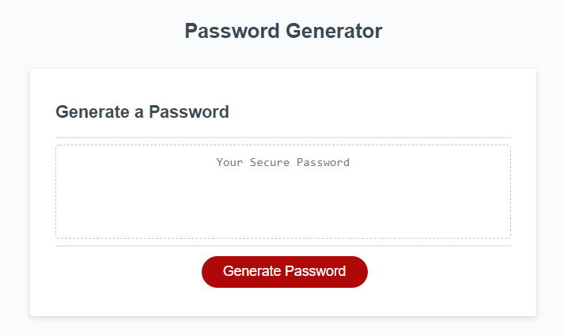
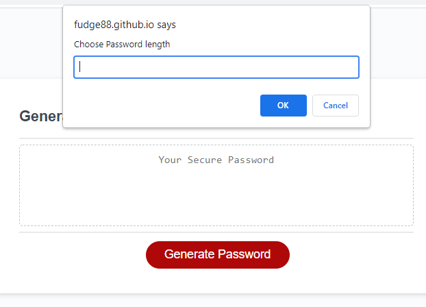
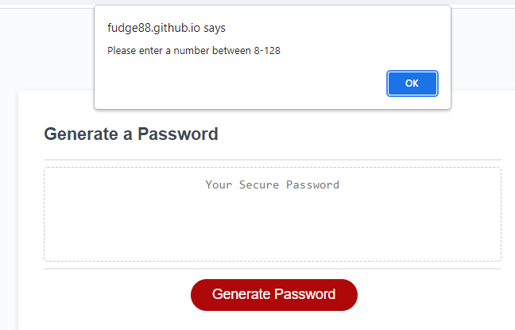
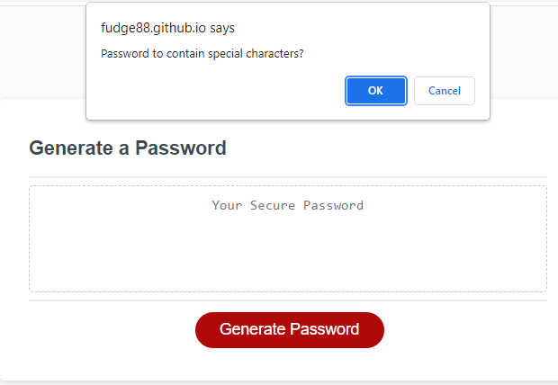
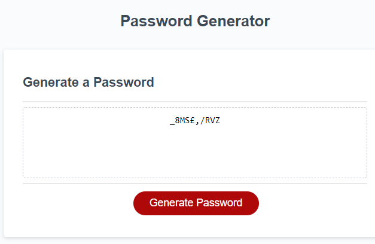

# Fahra's Random Password Generator

A fully functional password generator.

#### You can view the deployed function by [clicking here!](https://fudge88.github.io/password-generator/)



## Summary

Ths Password generator prompts the user to select the characteristics they would want in their password.  
The user is asked to input a number for the length of their password; a series of boxes appear asking the user  
to confirm the characteristics they wish their password to have such as:

- lower case characters
- upper case characters
- numerical characters
- special characters

The below image demonstrates the input required from the user. The input box requests a numerical input, if the user inputs a letter or a special character, the user is alerted to input a valid number.



If the User inputs a number that is less then 8 or more then 128 (noted in the acceptance criteria), the following alert will pop up, returning the user back to the start.



The below image demonstrates a different style of input required from the user, the function then takes the responses from the user and merges the entire catalog of chosen characteristics together.



This is where the 'looping function' generates a random string of characters from the merged list (as described above), to form a random password.



## User Story

```
AS AN employee with access to sensitive data
I WANT to randomly generate a password that meets certain criteria
SO THAT I can create a strong password that provides greater security
```

## Acceptance Criteria

```
GIVEN I need a new, secure password
WHEN I click the button to generate a password
THEN I am presented with a series of prompts for password criteria
WHEN prompted for password criteria
THEN I select which criteria to include in the password
WHEN prompted for the length of the password
THEN I choose a length of at least 8 characters and no more than 128 characters
WHEN asked for character types to include in the password
THEN I confirm whether or not to include lowercase, uppercase, numeric, and/or special characters
WHEN I answer each prompt
THEN my input should be validated and at least one character type should be selected
WHEN all prompts are answered
THEN a password is generated that matches the selected criteria
WHEN the password is generated
THEN the password is either displayed in an alert or written to the page
```

## Tools Used:

#### Languages:

- JavaScript
- HTML
- CSS

## references

Credit to Natasha Mann and Leanne Gallagher who i worked with through this project.

[MDNWebDocs](https://developer.mozilla.org/en-US/docs/Web/JavaScript)

[StackOverflow looping examples](https://stackoverflow.com/questions/3010840/loop-through-an-array-in-javascript)

[StackOverflow random password examples](https://stackoverflow.com/questions/1497481/javascript-password-generator)
